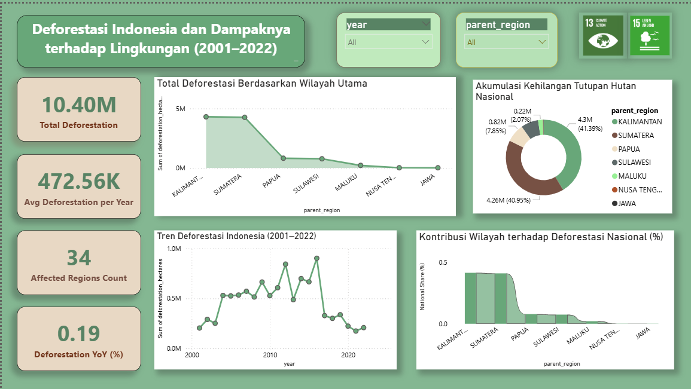

# 🌳 Deforestasi Indonesia dan Dampaknya terhadap Lingkungan (2001–2022)

**End-to-End Data Analysis & Visualization Project (SDGs-Focused)**

## 📌 Project Overview
Project ini menganalisis **deforestasi di Indonesia periode 2001–2022** untuk memahami pola kehilangan tutupan hutan antar wilayah dan dampaknya terhadap lingkungan. Analisis dilakukan untuk mendukung **pengambilan keputusan berbasis data** dalam konteks keberlanjutan dan pembangunan berkelanjutan (**SDGs 13: Climate Action & SDGs 15: Life on Land**).

Hasil analisis divisualisasikan dalam **dashboard interaktif** untuk memudahkan eksplorasi tren, kontribusi wilayah, dan perbandingan antar region.

### Key Highlight
* Total kehilangan tutupan hutan nasional mencapai **±10.4 juta hektar** (2001–2022).
* **Kalimantan dan Sumatera** menjadi kontributor deforestasi terbesar secara nasional.
* Tren deforestasi menunjukkan **penurunan signifikan setelah 2016**, meskipun masih terjadi secara konsisten.

---

## 🗂️ Repository Structure

```
├── deforestation_indonesia.csv        # Dataset deforestasi Indonesia (2001–2022)
├── deforestation_analysis.ipynb       # Data cleaning & analysis (Python)
├── deforestation_dashboard.pbix       # Power BI interactive dashboard
├── assets/
│   └── dashboard_preview.png          # Dashboard image
└── README.md
```
---

## 📊 Dashboard Preview


Dashboard menampilkan:
* Total & rata-rata deforestasi nasional
* Tren deforestasi tahunan
* Kontribusi wilayah terhadap deforestasi nasional
* Distribusi kehilangan tutupan hutan per region
* Filter interaktif berdasarkan **tahun** dan **wilayah utama**

---

## 🎯 Business / Policy Problem
Indonesia menghadapi tantangan besar dalam menekan laju deforestasi, namun pengambilan kebijakan sering kali terkendala oleh:
* Kurangnya gambaran komprehensif lintas wilayah
* Sulitnya mengidentifikasi region dengan dampak terbesar
* Minimnya insight berbasis tren jangka panjang

---

## 🎯 Objectives
* Mengukur **total dan rata-rata deforestasi nasional**
* Mengidentifikasi **wilayah dengan kontribusi deforestasi terbesar**
* Menganalisis **tren deforestasi tahunan (2001–2022)**
* Mendukung evaluasi kebijakan lingkungan berbasis data
* Menyediakan **dashboard interaktif** yang mudah dipahami stakeholder non-teknis

---

## 🛠️ Tech Stack & Workflow
### 1️⃣ Data Processing & Analysis (Python)
* **Python (Pandas, NumPy)**
  * Data cleaning dan agregasi tahunan
  * Perhitungan total, rata-rata, dan kontribusi wilayah
* Feature preparation untuk visualisasi dashboard

### 2️⃣ Exploratory Data Analysis
* Analisis tren deforestasi nasional
* Perbandingan deforestasi antar wilayah utama
* Identifikasi periode puncak dan penurunan deforestasi

### 3️⃣ Data Visualization (Power BI)
Dashboard interaktif menampilkan:
* **Total Deforestation** & **Average per Year**
* **Trend deforestasi tahunan**
* **Kontribusi wilayah (%)**
* **Akumulasi kehilangan tutupan hutan nasional**
* Filter dinamis berdasarkan **tahun** dan **parent region**

---

## 🔍 Key Insights & Findings

### 1️⃣ Kontribusi Wilayah Terbesar

* **Kalimantan (~41%)** dan **Sumatera (~41%)** mendominasi deforestasi nasional.
* Wilayah lain (Papua, Sulawesi, Maluku, Jawa) berkontribusi lebih kecil namun tetap signifikan secara ekologis.

---

### 2️⃣ Tren Deforestasi Nasional

* Puncak deforestasi terjadi pada **2009–2014**.
* Setelah 2016 terlihat tren penurunan, kemungkinan dipengaruhi oleh:

  * Kebijakan moratorium hutan
  * Peningkatan pengawasan lingkungan

---

### 3️⃣ Dampak Lingkungan

* Deforestasi yang tinggi berdampak langsung pada:

  * Emisi karbon
  * Kehilangan biodiversitas
  * Kerentanan terhadap perubahan iklim

---

## 📌 Conclusion
Project ini menunjukkan bahwa deforestasi di Indonesia masih terkonsentrasi pada wilayah tertentu dan membutuhkan **pendekatan kebijakan yang lebih terarah secara regional**. Dengan visualisasi interaktif, stakeholder dapat:
* Memantau tren jangka panjang
* Memprioritaskan wilayah kritis
* Mendukung strategi keberlanjutan berbasis data

Dashboard ini diharapkan dapat menjadi **alat pendukung keputusan** bagi pemerintah, NGO, peneliti, maupun publik.

---

## 🌱 SDGs Alignment
* **SDGs 13 – Climate Action**
* **SDGs 15 – Life on Land**

---

## 👤 Author
**Asri Sabilla Putri**
📊 Data Analyst | Sustainability & Digital Communication
🔗 LinkedIn: https://www.linkedin.com/in/asrisabilla
🌐 Portfolio: https://portofolio-asri.netlify.app/
